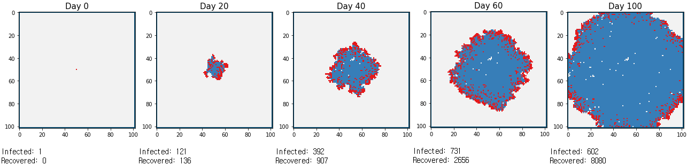
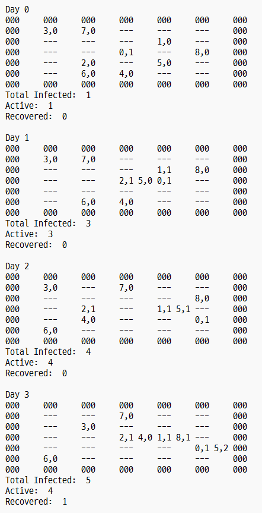
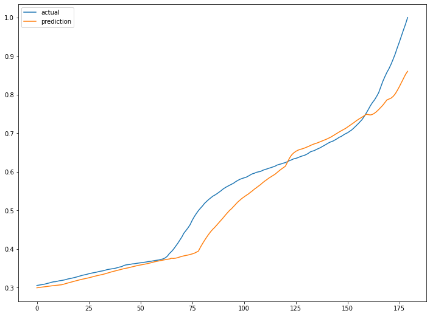

# EpiSim
Epidemic Simulation w/ Python

* EpiSim1
  * Visualizable (matplot.lib)
  * Object(person) does not move
  * Only one object(person) on each point of the grid

* EpiSim2
  * Non-visualizable, represented via text
  * Initial object density adjustable
  * Objects may move along the grid
  * More than one object can be on some point of the grid

* Episim_ML (incomplete)
  * Simulation w/ RNN, LSTM
  * Trained with real data of Republic of Korea, 2020  

